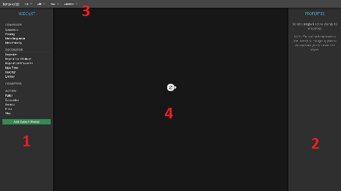

## The Interface

The main components of the interface are:

1. **Nodes panel**, where you see the nodes you can use in editor. Drag them to
   canvas to use.

2. **Properties panel**, where you see the node properties (the properties only
   appear when selecting a single block in the canvas).

3. **Menu bar** with mostly commands and options in the editor.

4. **Canvas**, where the magic happen. The initial block in the editor is 
   called "root", and represent the tree.

**Important**: you may be used to see BTs in a vertical tree diagram, where the
priority goes from left to right. Here, the BTs are shown in a horizontal 
diagram, where the priority goes from top to bottom.

## Controlling the Camera

### Moving

To **move the camera**, you must click and drag using the mouse 
`MIDDLE BUTTON`.

### Zooming

You can **zoom in and out** using:

- The mouse `WHEEL`;
- Menu option `View > Zoom In` or `View > Zoom Out`; or
- Using the keys `ctrl + up` or `ctrl + down`

Note: Firefox doesn't recognize the mouse wheel event inside the canvas. Thus, 
you have to use the alternative methods to zooming.