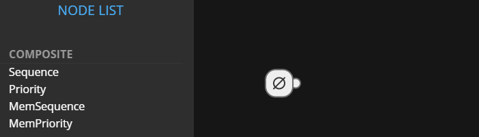
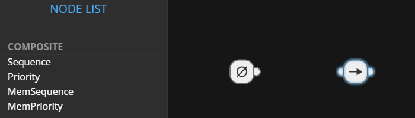

## Adding Nodes

Drag a node from the node panel to the canvas using the mouse `LEFT BUTTON` in
order to create a node block.

## Connecting Nodes

Drag the small circle at the right of the block (called anchor) to some other 
block using the mouse `LEFT BUTTON`. Notice:

- You can't connect a block to itself.
- The root node can only have a **single child**.
- All nodes can only have a **single parent**.
- Decorators can only have a **single child**.
- Actions and Conditions cannot have any children.

Remember: in order to make a valid tree, all nodes must have a connection path
to the root.
