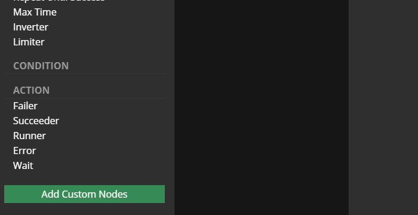

## Adding Custom Nodes

In order to **add custom nodes** in the editor:

1. Click in the button `Add Custom Nodes` at the node panel;

2. Type the name (obligatory), the title (optional), and select the node 
   category.
   - Note: you can add several nodes together, just press `+` to open new rows.

3. Press `Add` button.

Notice that:

- You don't need to create any code in order to add custom nodes in the editor, 
  but...
- You need to specify the node class when loading it with **Behavior3JS**;
    - Be aware that, the node name will be used to find the node when loading
      it from JSON.
    - Consult [to know more](Core 05 Creating Trees From JSON).

## Editing Custom Nodes

You can **edit existing nodes** by clicking the `edit` button (besides the node at the node panel).

Notice that, you cannot edit default nodes.

## Removing Custom Nodes

After clicking the `edit` button (besides the node at the node panel), you can **remove the node** by pressing the `Remove` button.

Notice that, you cannot remove default nodes.