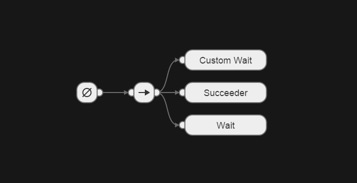

## Exporting Trees to JSON

You can export your current tree by going to menu `File > Export Tree`. Copy 
the JSON and paste to your file.

## Importing Trees from JSON

You can import trees from JSON file with:

1. Open your JSON file with some editor;
2. Copy the content;
3. In editor go to `File > Import Tree` and paste the content into the text 
   area;
4. Press `Continue`.
