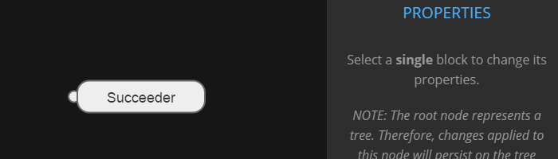

## Properties

**Select a single block** in order to see its properties. You can change:

- **title**: the node title, useful for editor and debug only;
- **description**: the node description, useful for editor and debug only;
- **properties**: a table with variables that will be used as argument to the initialize function when the node is created (by loading from JSON), and can be used inside the node for any reason.